# Project purpose
With this project that I did in my spare time in high school, I wanted to develop a project that my high school teacher could use as a resource for new students.
Since it is the first project, there may be mistakes and omissions.

# Solition Explorer / Layered Architecture
,

# DataBase
Previously MS-SQL was used, but I had to switch to MySQL.

# Used Packets
* [FakeData.1.0.0](https://www.nuget.org/packages/FakeData/)
* [iTextSharp.5.5.13.1](https://www.nuget.org/packages/iTextSharp/)
* [QRCoder.1.3.9](https://www.nuget.org/packages/QRCoder/)
* [WpfAnimatedGif.1.4.18](https://www.nuget.org/packages/WpfAnimatedGif/)

# Used .dll
* MySql.Data.dll
* webcam_capture.dll

# Edit DataBase Info
OFB.Data/Sql/SqlBaglanti.cs
```cs
  #region MYSQL_Local
  using (var baglanti = new MySqlConnection("SERVER=127.0.0.1;PORT=3306;DATABASE=ofb;UID=root;PWD=mysql;"))
  {
      baglanti.Open();
      return baglanti;
  }
  #endregion
```

# Images


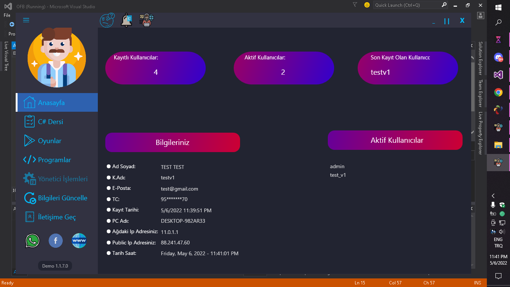
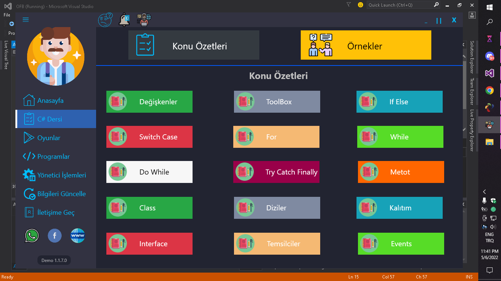
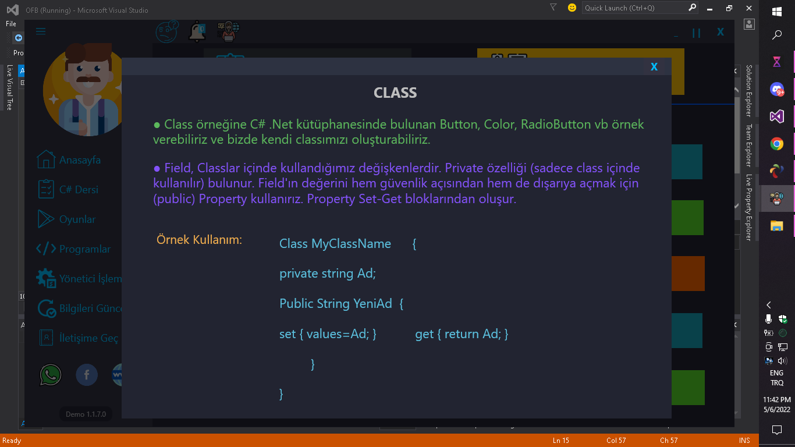
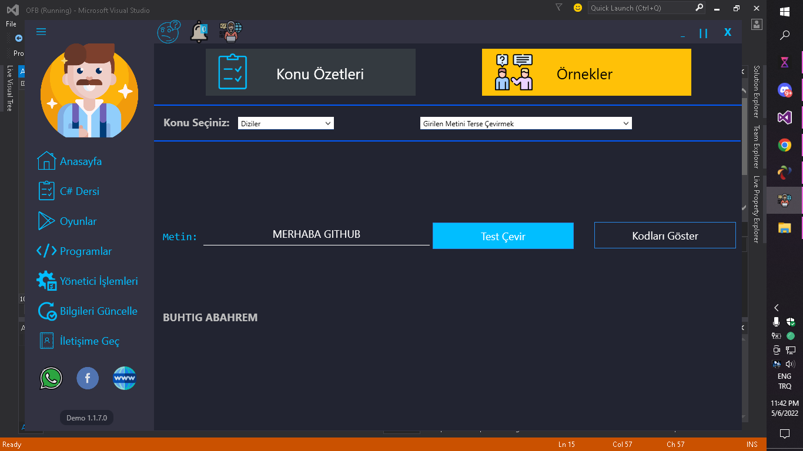
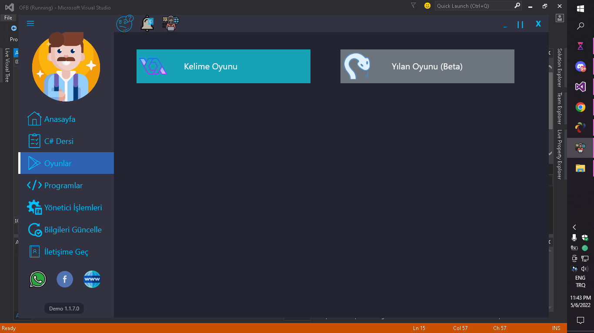
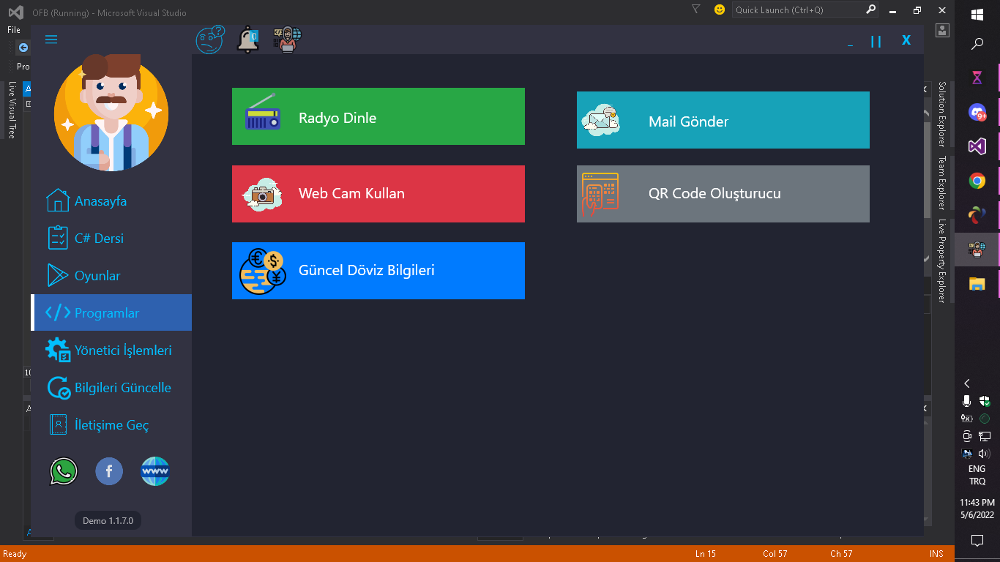
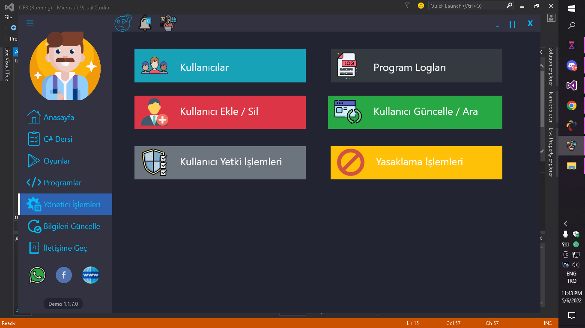
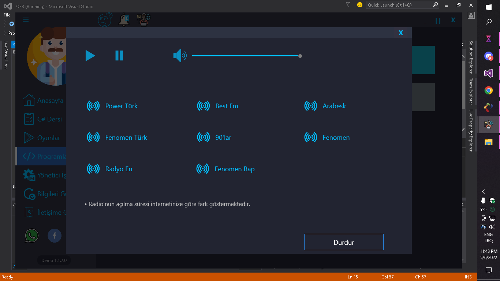
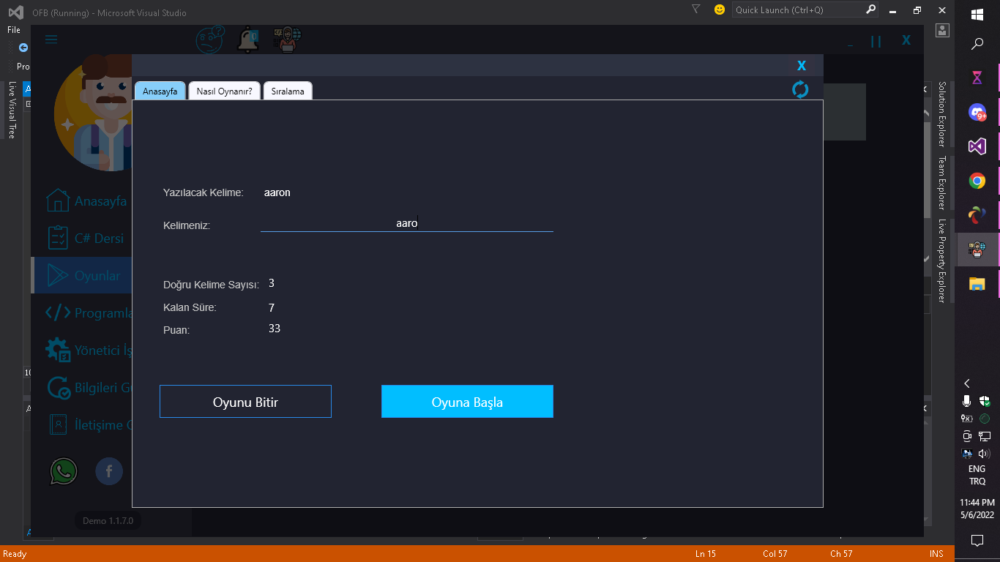
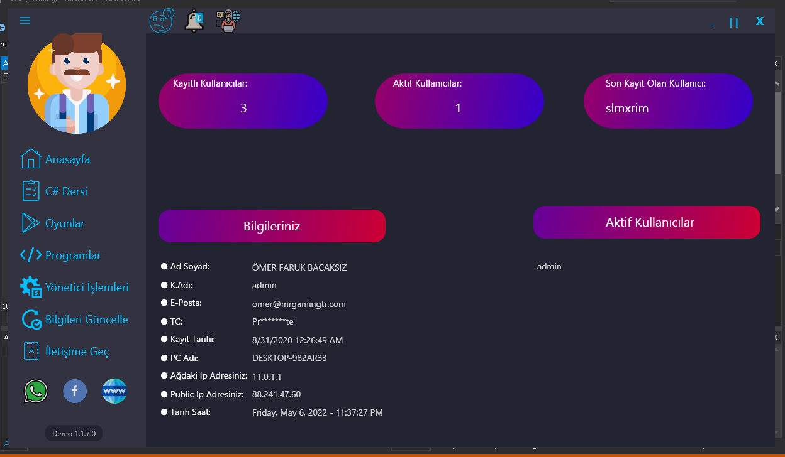

# Images-Modern MessageBox
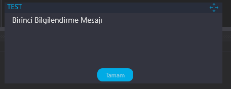

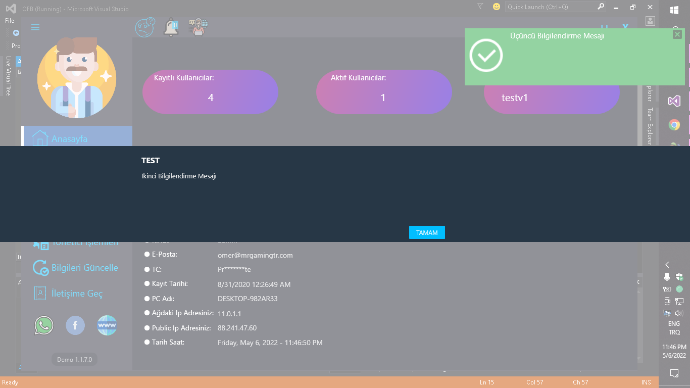
