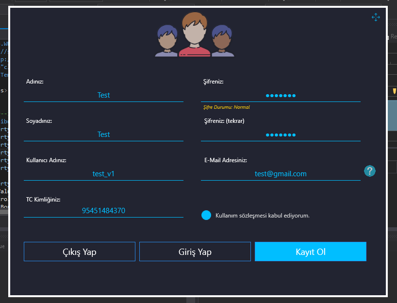
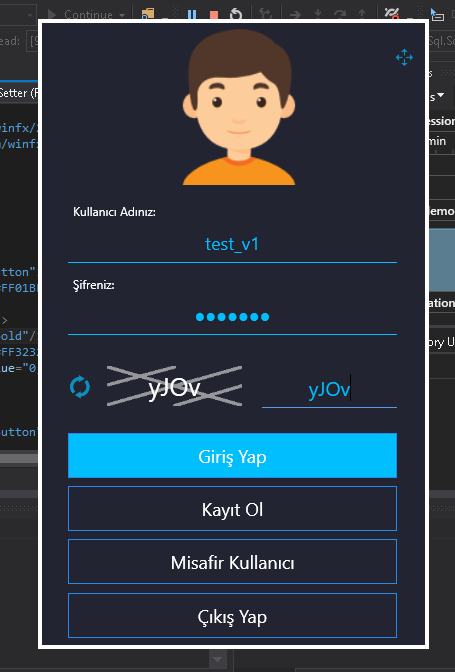

# Project purpose
With this project that I did in my spare time in high school, I wanted to develop a project that my high school teacher could use as a resource for new students.

# Solition Explorer

if you want to change the outputs all you have to do is:
```ino
#define red 9
#define green 10
#define blue 11
```

# Images



